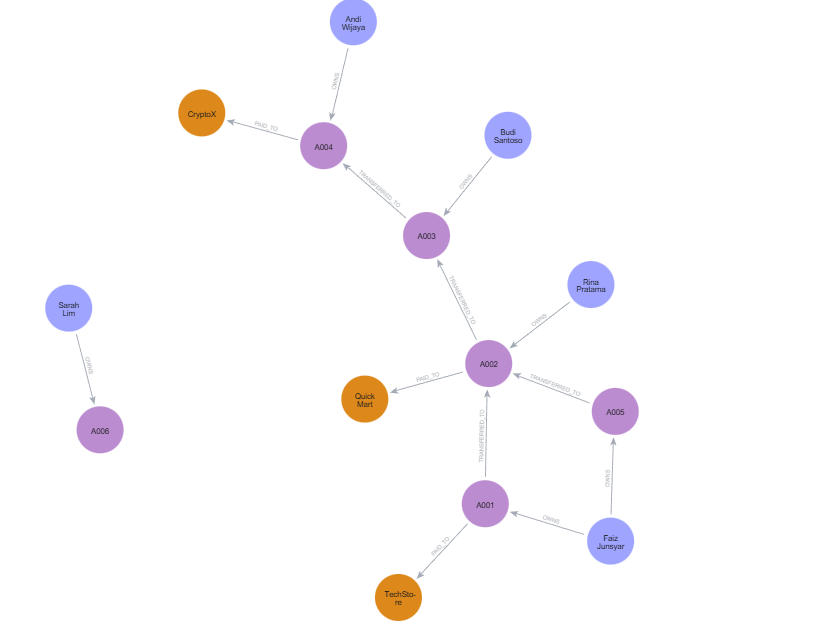
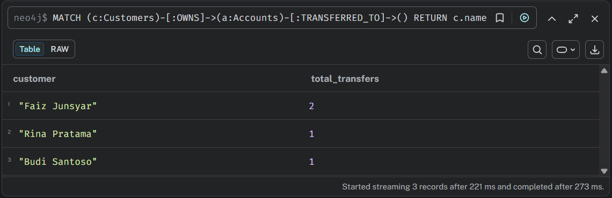

# BankGraphDB

Graph database project using **Neo4j** to model banking transactions and relationships between **customers, accounts, and merchants**.

This project demonstrates how graph databases can represent financial transaction networks and help analyze interactions between entities in a banking ecosystem.

---

## Project Overview

BankGraphDB models financial transaction relationships using a graph data model. Customers own accounts, accounts can transfer funds to other accounts, and accounts can make payments to merchants.

By representing these entities and relationships as a graph, it becomes easier to explore transaction patterns, analyze financial interactions, and understand how money flows within the system.

Graph databases are particularly useful for identifying complex patterns such as transaction networks, financial behavior analysis, and potential fraud detection.

---

## Technologies Used

- Python  
- Neo4j Graph Database  
- Cypher Query Language  
- CSV Datasets  

---

## Graph Data Model

This project models financial entities as nodes and their interactions as relationships.

### Nodes

- Customers
- Accounts
- Merchants

### Relationships

- **OWNS** → connects customers to their accounts  
- **TRANSFERRED_TO** → represents money transfers between accounts  
- **PAID_TO** → represents payments from accounts to merchants  

---

## Graph Visualization

Below is the visualization of the banking transaction graph.



---

## Business Questions

### 1. Most Active Customers

Identify customers with the highest number of transfers.

Query:

```cypher
MATCH (c:Customers)-[:OWNS]->(a:Accounts)-[:TRANSFERRED_TO]->()
RETURN c.name AS customer, COUNT(*) AS total_transfers
ORDER BY total_transfers DESC
LIMIT 5
```

